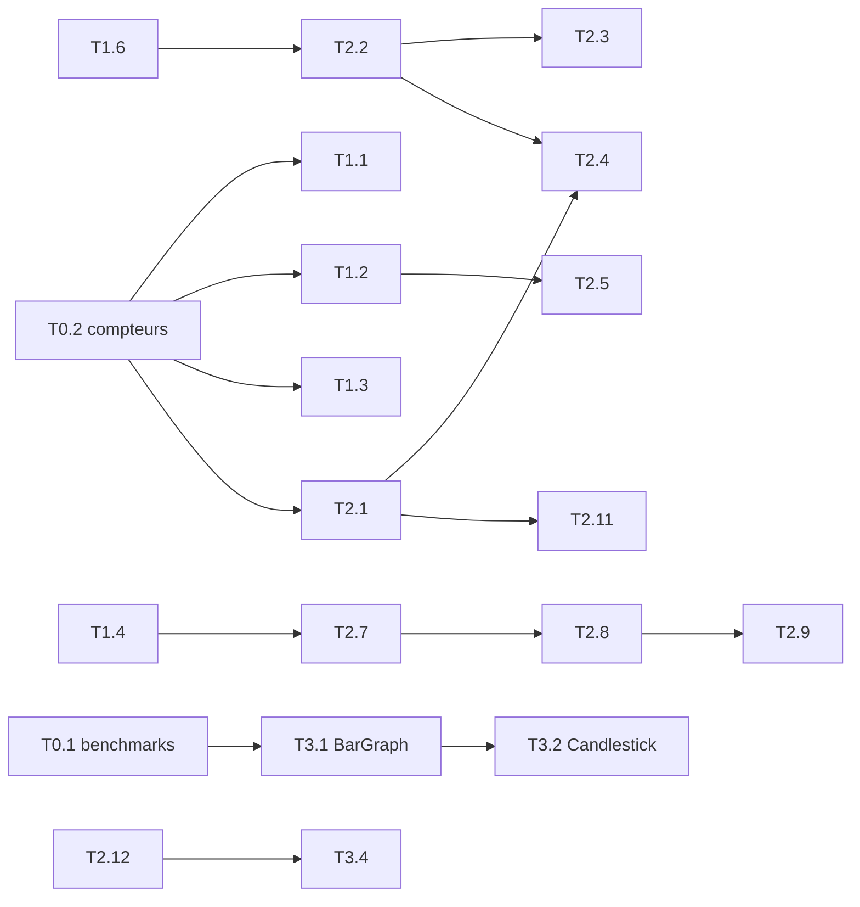

# Plan d'implémentation — performances pyqtgraph

> Document de travail destiné à des **agents IA de développement** (Claude Code ou équivalent)
> et à leurs relecteurs humains. Chaque tâche est autonome : un agent doit pouvoir l'exécuter
> à partir de sa seule fiche, de la section « Règles communes » et du code.
>
> - **Commit de référence de l'audit :** `cc94092` (branche `master`). Les numéros de ligne
>   cités sont valables à ce commit. Ils dérivent ensuite : retrouvez toujours le code par
>   **nom de fonction**, la ligne n'est qu'un indice.
> - **Contexte d'usage visé :** applications de marchés financiers. Cela couvre les courbes
>   temps réel (10⁵ à 10⁷ ticks, 30-60 Hz), le nuage des transactions, les volumes et bougies,
>   la carte de chaleur du carnet d'ordres, plusieurs graphiques liés sur un axe de dates,
>   un réticule et des centaines de lignes d'ordres.
> - **Environnement de mesure :** PyQt6 6.11, numpy 2.5.3, Python 3.13, plateforme Qt
>   `offscreen` (rendu raster, pas d'OpenGL), numba et cupy non installés. Les chiffres sont des
>   ordres de grandeur (±10 %), à re-mesurer sur votre machine.

---

## Sommaire

1. [Règles communes pour l'agent](#1-règles-communes-pour-lagent)
2. [Tableau de bord des tâches](#2-tableau-de-bord-des-tâches)
3. [Phase 0 — Socle de mesure](#3-phase-0--socle-de-mesure)
4. [Phase 1 — Gains rapides, risque faible](#4-phase-1--gains-rapides-risque-faible)
5. [Phase 2 — Chantiers structurants](#5-phase-2--chantiers-structurants)
6. [Phase 3 — Éléments graphiques finance](#6-phase-3--éléments-graphiques-finance)
7. [Phase 4 — Optionnel](#7-phase-4--optionnel)
8. [Pistes écartées (ne pas implémenter)](#8-pistes-écartées-ne-pas-implémenter)
9. [Annexe A — Mesures de référence](#9-annexe-a--mesures-de-référence)
10. [Annexe B — Prompt type pour lancer un agent](#10-annexe-b--prompt-type-pour-lancer-un-agent)

---

## 1. Règles communes pour l'agent

### 1.1 Environnement

```bash
# Dépendances Python
python -m pip install numpy scipy pyqt6 pytest pytest-qt -e .

# Linux sans écran : bibliothèques système nécessaires à QtGui
#   (sinon : "ImportError: libEGL.so.1")
apt-get install -y libegl1 libgl1 libxkbcommon0 libfontconfig1 libdbus-1-3

# Toujours exécuter Qt sans écran
export QT_QPA_PLATFORM=offscreen
```

Pour lancer les tests :

```bash
python -m pytest tests -q -p no:cacheprovider
```

Référence à `cc94092` : `pytest tests/graphicsItems tests/test_functions.py` donne
**339 passed, 5 skipped**.

### 1.2 Déroulé obligatoire pour chaque tâche

1. **Une tâche = une branche = une PR.** Ne mélangez jamais deux tâches. La PR cible `master`.
2. **Lisez la fiche en entier**, puis le code cité (par nom de fonction).
3. **Mesurez avant.** Lancez le scénario de benchmark indiqué (créé en phase 0) et notez la
   valeur de départ.
4. **Écrivez d'abord le test de non-régression.** Il échoue sur le code actuel quand c'est
   possible (comptage d'appels, cache conservé, etc.).
5. **Implémentez le correctif minimal** décrit dans la fiche. N'élargissez pas le périmètre.
6. **Mesurez après.** Indiquez dans la PR les chiffres avant/après, la machine et la version de Qt.
7. **Lancez toute la suite de tests**, puis relisez votre diff de façon critique avant de pousser.
8. **Mettez à jour le statut** de la tâche dans le [tableau de bord](#2-tableau-de-bord-des-tâches).

### 1.3 Conventions de code

- **Respectez le style du fichier modifié** : nommage camelCase de l'API Qt et pyqtgraph,
  dictionnaire `opts`, signaux `sig*`.
- **Indications de type complètes** sur toute fonction nouvelle ou modifiée.
- **Docstrings au format numpydoc** (`Parameters`, `Returns`, voir `CONTRIBUTING.md`).
  Les sections sont obligatoires dès qu'il y a des paramètres ou une valeur de retour.
- **Nouvelles classes** (phase 3) : attributs privés (`self._x`) exposés par des propriétés
  (getter/setter). L'API publique reste néanmoins de style pyqtgraph
  (`setData()`, `setOpts()`, `dataBounds()`, `boundingRect()`, `paint()`).
- **Compatibilité des liaisons Qt :** PyQt5, PyQt6 et PySide6 doivent fonctionner.
  - Utilisez les enums complètement qualifiés, par exemple
    `QtWidgets.QGraphicsItem.GraphicsItemFlag.ItemIgnoresTransformations`.
  - Pour l'accès mémoire bas niveau aux objets Qt, réutilisez `pyqtgraph/Qt/internals.py`
    (`PrimitiveArray`, `get_qpainterpath_element_array`). N'écrivez pas de nouveau code
    spécifique à `sip` ou `shiboken`.
- **Dépendances :** numpy reste la seule dépendance obligatoire. numba et cupy restent
  optionnels, derrière `getConfigOption('useNumba')` et `getConfigOption('useCupy')`.
- **Aucun changement de comportement visible** (API, valeurs par défaut, rendu) sauf si la
  fiche l'autorise explicitement. Dans ce cas, documentez-le dans la PR.

### 1.4 Tests de performance : principes

- **Les tests unitaires ne vérifient jamais un temps d'exécution** : trop instable en CI.
  Ils vérifient des **invariants déterministes** :
  - nombre d'appels à `paint`, `setData`, `updateItems`, `dataBounds`, etc. ;
  - cache conservé ou invalidé à bon escient ;
  - absence de création d'objets par point.
- **Les temps se mesurent dans `benchmarks/`**, au format asv (`setup` / `time_*`), comme
  `benchmarks/arrayToQPath.py`, et dans les scripts de scénarios (tâche T0.1).
- **Le rendu doit rester identique.** Quand une tâche touche au rendu, ajoutez un test qui
  compare pixel à pixel une `QImage` rendue avant et après, ou vérifiez avec les tests
  d'images existants (`tests/image_testing.py`).

### 1.5 Définition de « terminé »

- [ ] Gain mesuré, au moins égal à l'objectif de la fiche, chiffres dans la PR.
- [ ] Tests ajoutés, qui échouent sans le correctif quand c'est possible.
- [ ] `pytest tests` vert.
- [ ] Aucun changement d'API publique non prévu par la fiche.
- [ ] Docstrings et types à jour.
- [ ] Statut mis à jour dans le tableau de bord.

---

## 2. Tableau de bord des tâches

**Légende :**
- **Effort :** S < ½ jour d'agent, M = 1-2 jours, L > 2 jours.
- **Risque :** F faible, M moyen, É élevé.
- **Statut :** ☐ à faire, ◐ en cours ou partiel (voir le message du commit), ☑ fait.

| ID | Tâche | Phase | Effort | Risque | Gain attendu (scénario) | Dépend de | Statut |
|----|-------|:-----:|:------:|:------:|-------------------------|-----------|:------:|
| T0.1 | Scénarios de benchmark reproductibles | 0 | M | F | — (mesure) | — | ☑ |
| T0.2 | Compteurs d'instrumentation pour les tests | 0 | S | F | — (mesure) | — | ☑ |
| T1.1 | Ne plus vider le cache des bornes de données au zoom | 1 | S | F | 2-4 parcours O(N) en moins par image | T0.2 | ☑ |
| T1.2 | Pas de `setData` sur pan/zoom Y sans écrêtage effectif | 1 | S | F | pan Y nuage 1e5 : 394 → ~36 ms | T0.2 | ☑ |
| T1.3 | Cache `childrenBounds` actif ; ignorer les objets `ignoreBounds` | 1 | M | F | réticule : 58 → ~9 ms/mouvement | T0.2 | ☑ |
| T1.4 | Test « is None » par identité dans `ScatterPlotItem._style` | 1 | S | F | −115 ms par `setData` de 1e5 | — | ☑ |
| T1.5 | SpotItem créés seulement pour les points touchés | 1 | S | F | 1er survol 1e6 : 2,3 s → < 50 ms | — | ☑ |
| T1.6 | Supprimer la copie `x[np.isfinite(x)]` du sous-échantillonnage | 1 | S | F | −43 ms/`setData` à 1e7 | — | ☑ |
| T1.7 | Table de couleurs > 256 entrées ramenée à 256 (images float) | 1 | S | F | 11 → 3,3 ms (2000×1000) | — | ☑ |
| T1.8 | `InfiniteLine` : `prepareGeometryChange` hors de `boundingRect` | 1 | S | F | ~−30 % par ligne | — | ☑ |
| T1.9 | Légende et liste des paramètres sans coût quadratique | 1 | S | F | 500 courbes : 4,05 → ~0,6 s | — | ☑ |
| T1.10 | `itemsNearEvent` : une seule requête, filtrer avant de trier | 1 | S | F | 4,65 → 2,3 ms/mouvement (500 courbes) | — | ☑ |
| T1.11 | Bugs d'API qui désactivent des optimisations | 1 | S | F | `clipToView`/`autoDownsample` réellement actifs | — | ☑ |
| T2.1 | Supprimer le double rendu par mise à jour | 2 | M | M | −25 à −45 % par image | T0.2 | ☑ |
| T2.2 | Pipeline courbe : un seul passage O(N) par `setData` | 2 | M | F | 1e7 clip+ds : 100 → ~5 ms/image | T1.6 | ☑ |
| T2.3 | Flux incrémental : `appendData`, blocs de pics alignés et mis en cache | 2 | L | M | 1e7 vue complète : ~2 ms/image | T2.2 | ☑ |
| T2.4 | Données affichées calculées une seule fois par image | 2 | M | M | ÷2,5 sur le traitement des données | T2.1, T2.2 | ☑ |
| T2.5 | Ne plus forcer `styleUpdate=True` dans `updateItems` | 2 | M | M | styles non renvoyés à chaque image | T1.2 | ☑ |
| T2.6 | Chemin rapide `drawPolyline` pour les courbes simples | 2 | M | M | construction ×2,5, −33 % de mémoire | — | ◐ |
| T2.7 | Atlas de symboles indexé par valeur, tailles quantifiées | 2 | M | F | ×30 à ×300 (couleurs/tailles par point) | T1.4 | ☑ |
| T2.8 | Styles du nuage calculés par combinaison unique et chemin numérique | 2 | L | M | `setData` 1e5 : 330 → < 30 ms | T2.7 | ☑ |
| T2.9 | `ScatterPlotItem.paint` : préparation vectorisée | 2 | M | M | 1e6 : 314 → ~190 ms/rendu | T2.8 | ☑ |
| T2.10 | `AxisItem` : cache des libellés et de leur géométrie | 2 | M | F | −35 % par régénération d'axe | — | ☑ |
| T2.11 | `TextItem` : plus de slot par élément sur le signal de rendu | 2 | M | M | ~×3 par élément | T2.1 | ☑ |
| T2.12 | `ImageItem` : NaN gérés via un index réservé, sans masque RGBA | 2 | M | F | NaN : 15-29 → ~3 ms | — | ☑ |
| T3.1 | `BarGraphItem` : découpage à la vue et LOD | 3 | M | F | 500k barres zoomées : 30 → ~2 ms | T0.1 | ☑ |
| T3.2 | Nouvel élément `CandlestickItem` (OHLC) vectorisé | 3 | L | F | bougies natives, LOD par agrégation OHLC | T3.1 | ☑ |
| T3.3 | `FillBetweenItem` reconstruit seulement au rendu, depuis numpy | 3 | M | F | 200k : 60 → < 5 ms/image | — | ☑ |
| T3.4 | `NonUniformImage` réécrit (QImage + table d'index) | 3 | L | M | 2000×1000 : 7,2 s → < 50 ms | T2.12 | ☑ |
| T4.x | Optionnels (voir §7) | 4 | — | — | — | — | ◐ |

**Ordre recommandé :**
1. T0.1 → T0.2
2. Toute la phase 1 (les tâches sont indépendantes entre elles et parallélisables)
3. T2.1
4. T2.2 → T2.3 → T2.4
5. Le reste de la phase 2
6. Phase 3



---

## 3. Phase 0 — Socle de mesure

### T0.1 — Scénarios de benchmark reproductibles

- **Effort / Risque :** M / F
- **Fichiers à créer :**
  - `benchmarks/scenarios.py` : script autonome, sortie texte en ms ;
  - `benchmarks/streaming.py`, `benchmarks/scatter.py`, `benchmarks/framework.py` : classes au
    format asv, sur le modèle de `benchmarks/arrayToQPath.py`.
- **Objectif :** chaque fiche de ce plan pointe vers un scénario `Sxx`. Un agent doit pouvoir
  lancer `python benchmarks/scenarios.py S05` et obtenir le temps médian, ainsi que les
  compteurs pertinents (rendus, `setData`).

**Scénarios à implémenter** (paramètres identiques à ceux de l'audit, voir annexe A) :

| ID | Scénario | Mesure |
|----|----------|--------|
| S01 | `PlotWidget` 1000×600 ; courbe N ∈ {1e6, 1e7} ; ajout d'1 point par image + `setData` + rendu. Variantes : défaut (autorange), `autoDownsample` peak en vue complète, `clipToView` + `autoDownsample` avec la vue qui suit les 5 000 derniers points | ms/image |
| S02 | Pan Y pas à pas sur une courbe N ∈ {1e6, 1e7}, options par défaut | ms/pas, reconstructions du chemin par pas |
| S03 | `ScatterPlotItem.setData` N ∈ {1e5, 1e6}. Variantes : style uniforme, 5 `QBrush` réutilisés par point, tuples de couleur par point, tailles flottantes continues | ms/`setData` |
| S04 | Nuage N ∈ {1e5, 1e6} : premier `hoverEvent` après `setData`, `pointsAt`, survol stable, pan Y via `PlotDataItem(symbol='o')` | ms |
| S05 | `GraphicsLayoutWidget` 1400×900, 3 `PlotItem` liés en X avec `DateAxisItem`, 20 courbes + 1 volume avec remplissage + 1 indicateur ; flux à 33 ms. Variantes : 300 / 2000 points par courbe ; avec 200 `InfiniteLine` + 200 `TextItem` | ms/mise à jour, **rendus par mise à jour** |
| S06 | Réticule : 2 `InfiniteLine` (`ignoreBounds=True`) + `TextItem` déplacés à chaque mouvement de souris sur S05 | ms/mouvement |
| S07 | 500 courbes, pas de zoom Y | ms/pas |
| S08 | `BarGraphItem` N ∈ {2e4, 5e5}, vue complète avec et sans contour, vue réduite à 200 barres | ms/rendu |
| S09 | `FillBetweenItem` entre deux courbes de 200k points, mise à jour des deux courbes | ms/mise à jour, appels à `updatePath` |
| S10 | `ImageItem` 2000×1000 float32. Variantes : sans NaN, 0,04 % NaN, 30 % NaN ; table de couleurs 256 contre 512 | ms (`setImage` + rendu) |
| S11 | Ajout de 500 courbes nommées avec légende | s |
| S12 | `NonUniformImage` 2000×1000 ; `PColorMeshItem` 400×200 | ms/mise à jour, ms/rendu |

**Implémentation :**
- **Rendu :** `QImage` + `QPainter` ou `widget.grab()`. Pour le flux, utilisez
  `app.processEvents()` en boucle.
- **Médiane** sur au moins 5 répétitions, après 2 tours de chauffe.
- **Comptages :** enveloppez les méthodes ciblées (`PlotCurveItem.paint`,
  `PlotCurveItem.setData`, `PlotDataItem.updateItems`, etc.) avec un compteur.
- **Sortie :** une ligne par variante, par exemple `S05[300pts] 49.5 ms/update paints=1.93`.

**Critère d'acceptation :** les valeurs de départ reproduisent l'ordre de grandeur de
l'annexe A sur la machine de l'agent.

### T0.2 — Compteurs d'instrumentation pour les tests

- **Effort / Risque :** S / F
- **Fichier à créer :** `tests/perf_helpers.py`.
- **Contenu :**
  - un gestionnaire de contexte `count_calls(obj_or_class, "method_name")`, qui enveloppe une
    méthode et expose `.count` ;
  - une fonction `paints_per_update(widget, update_fn, n=20)`, qui affiche le widget en
    offscreen, applique `update_fn` n fois avec `processEvents()` et renvoie le nombre moyen
    d'appels à `paint` de l'élément visé.
- **Usage :** fournit les assertions déterministes des tâches T1.x et T2.x.
- **Critère d'acceptation :** un test de démonstration montre qu'aujourd'hui
  `paints_per_update` vaut environ 2 sur un `PlotWidget` en autorange. Ce test sert de base à
  T2.1. Marquez-le `xfail` tant que T2.1 n'est pas fait, si vous écrivez l'assertion ≤ 1,05.

---

## 4. Phase 1 — Gains rapides, risque faible

### T1.1 — Ne plus vider le cache des bornes de données lors d'un changement de vue

- **Effort / Risque :** S / F — **Scénarios :** S02, S05.
- **Fichiers :**
  - `pyqtgraph/graphicsItems/PlotCurveItem.py` : `viewTransformChanged` (l. 445-447),
    `invalidateBounds` (l. 484-486), `updateData` (l. 630-631) ;
  - `pyqtgraph/graphicsItems/ScatterPlotItem.py` : `viewTransformChanged` (l. 928-931).
- **Problème :**
  - `PlotCurveItem.viewTransformChanged` appelle `invalidateBounds()`, qui vide aussi
    `_boundsCache`. Or les bornes de données ne dépendent pas de la vue : seul
    `_boundingRect` dépend de la taille d'un pixel.
  - Résultat : 2 recalculs complets `nanmin`/`nanmax` par image en pan, 4 par image en flux
    avec autorange, soit environ 30 ms par paire à 1e7 points.
  - Même défaut dans `ScatterPlotItem.viewTransformChanged`, qui fait
    `self.bounds = [None, None]` : 30 ms par image à 1e6 points.
  - Par ailleurs, `invalidateBounds()` est appelé **avant** `prepareGeometryChange()`. Qt
    recommande d'appeler `prepareGeometryChange()` avant que `boundingRect()` ne change.
- **Étapes :**
  1. Dans `PlotCurveItem.viewTransformChanged`, n'invalider que `self._boundingRect = None`
     (créer au besoin une méthode privée `_invalidateBoundingRect()`). Ne pas toucher à
     `_boundsCache`.
  2. Dans `viewTransformChanged` et `updateData`, appeler `prepareGeometryChange()` **avant**
     l'invalidation.
  3. Dans `ScatterPlotItem.viewTransformChanged`, supprimer `self.bounds = [None, None]`, en
     vérifiant que `boundingRect()` recalcule bien la marge en pixels à partir de
     `pixelPadding()`.
- **Tests :**
  - après `setData` puis plusieurs `vb.translateBy` / `vb.scaleBy`, le nombre d'appels au
    calcul des bornes (compteur T0.2 sur `np.nanmin` ou sur la branche de calcul de
    `dataBounds`) reste égal à 1 par axe ;
  - `boundingRect()` change toujours avec le zoom (marge en pixels).
- **Objectif :** 0 recalcul de bornes par pan (au lieu de 2) ; pan X à 1e7 : environ −10 %.

### T1.2 — Pas de `setData` sur pan/zoom Y quand l'écrêtage dynamique n'est pas actif

- **Effort / Risque :** S / F — **Scénarios :** S02, S04 (pan Y du nuage), S07.
- **Fichier :** `pyqtgraph/graphicsItems/PlotDataItem.py` :
  - `viewRangeChanged` (l. 1809-1830) ;
  - `_getDisplayDataset` (l. 1447 ; bloc `dynamicRangeLimit` l. 1618-1657) ;
  - `_drlLastClip` (l. 589) ;
  - `updateItems` (l. 1328).
- **Problème :**
  - Avec la valeur par défaut `dynamicRangeLimit=1e6` (l. 626), **tout** changement de plage
    Y déclenche `updateItems()`, qui appelle `curve.setData` (le chemin est jeté, l. 646) et
    `scatter.setData` (le nuage est entièrement reconstruit, avec ses styles).
  - Cela arrive même quand aucun écrêtage n'est nécessaire, c'est-à-dire quand les données
    tiennent dans `2·hyst·limit·hauteur_vue`, et même quand les tableaux affichés sont
    inchangés : un nouveau `PlotDataset` est créé à chaque fois (l. 1657).
  - **Mesures :**
    - pan Y : nuage 1e5 = 394 ms par pas (36 ms sans `dynamicRangeLimit`) ; courbe 1e7 =
      682 ms par pas ;
    - 500 courbes : 33,5 ms de signaux par changement de plage ;
    - 40 `setData` par image au lieu de 22 dans S05.
- **Étapes :**
  1. Ajouter un attribut privé `self._drlClipActive: bool = False`, mis à `True` quand
     `fn.clip_array` est appliqué et à `False` quand le bloc conclut « pas d'écrêtage ».
  2. Dans `viewRangeChanged`, pour un changement Y seul : ne mettre `update_needed = True` que
     si `self._drlClipActive` est vrai **ou** si l'écrêtage devient nécessaire avec la nouvelle
     vue. Utilisez le même prédicat que l. 1625-1634, factorisé dans une méthode privée
     `_drlClipRequired(data_range, view_range) -> bool`. `dataRect()` est en cache sur
     `_datasetMapped`, le test est donc O(1).
  3. Dans `updateItems`, si le `PlotDataset` d'affichage renvoyé porte **les mêmes objets**
     `x` et `y` (`is`) que lors du dernier envoi, et qu'aucun style n'a changé, ne pas
     rappeler `curve.setData` / `scatter.setData`. Mémoriser les derniers tableaux envoyés
     dans des attributs privés.
- **Tests :**
  - avec une courbe de 1e4 points sans valeurs extrêmes, 10 `setYRange` successifs donnent
    0 appel à `PlotCurveItem.setData` et 0 à `ScatterPlotItem.setData` ;
  - avec des données contenant une valeur de 1e12 et une vue zoomée sur [0, 1],
    l'écrêtage s'applique toujours. Ce test de non-régression est à **créer** dans
    `tests/graphicsItems/test_PlotDataItem.py` : aucun test actuel ne couvre
    `dynamicRangeLimit`.
- **Objectif :** pan Y du nuage 1e5 < 50 ms par pas ; S07 : −50 % au moins.

### T1.3 — Cache de `childrenBounds` actif ; ignorer les objets ajoutés avec `ignoreBounds=True`

- **Effort / Risque :** M / F — **Scénarios :** S05 (variante 200 lignes et textes), S06.
- **Fichiers :**
  - `pyqtgraph/graphicsItems/ViewBox/ViewBox.py` :
    - `addedItems` (l. 137) ;
    - `_itemBoundsCache` (l. 181), **jamais rempli** ;
    - `addItem` (l. 424) ;
    - `queueUpdateAutoRange` (l. 930) ;
    - `itemBoundsChanged` (l. 1151) ;
    - `childrenBounds` (l. 1452) ;
  - `pyqtgraph/graphicsItems/GraphicsObject.py` : `itemChange` (l. 19-37).
- **Problème :**
  1. **Les objets `ignoreBounds` relancent quand même l'autorange.** Un `setPos` sur un objet
     ajouté avec `ignoreBounds=True` (réticule, ligne d'ordre) passe par `itemChange`, puis
     `ViewBox.itemBoundsChanged`, `queueUpdateAutoRange` et `self.update()` : toute la
     ViewBox est redessinée, avec un passage `childrenBounds`. Coût : 58,4 ms par mouvement de
     réticule avec 22 courbes de 2000 points.
  2. **`childrenBounds` recalcule chaque objet à chaque appel**, soit environ 12 µs par objet :
     `hasattr` sur des objets sip, `transformAngle`, `mapFromItemToView`. Avec 400 objets :
     4,86 ms par appel.
- **Étapes :**
  1. Maintenir, en plus de la liste `addedItems`, un ensemble `self._boundedItems` (objets
     ajoutés **sans** `ignoreBounds`), mis à jour dans `addItem` et `removeItem`.
  2. Dans `itemBoundsChanged(item)`, remonter de `item` vers l'ancêtre présent dans
     `_boundedItems` (par exemple `PlotCurveItem` → `PlotDataItem`). S'il n'y en a pas,
     **sortir immédiatement**.
  3. Remplir `_itemBoundsCache[item]` dans `childrenBounds`, avec une clé
     `(frac, orthoRange)` comprenant la transformation de l'objet vers la vue. L'invalider dans
     `itemBoundsChanged` pour l'ancêtre trouvé, et globalement quand la transformation de
     `childGroup` change si la clé en dépend.
  4. Ne pas appeler `self.update()` dans `queueUpdateAutoRange` quand l'autorange est
     désactivé sur les deux axes.
- **Tests :**
  - déplacer 100 fois une `InfiniteLine` ajoutée avec `ignoreBounds=True` donne 0 appel à
    `updateAutoRange` ;
  - un deuxième appel à `childrenBounds` sans changement ne rappelle pas `dataBounds` sur
    les enfants ;
  - l'autorange réagit toujours à un `setData`.
- **Objectif :** S06 < 12 ms par mouvement (au lieu de 58) ; `childrenBounds` avec 400 objets
  < 1 ms.
- **Conseil applicatif à documenter** dans la docstring de `addItem` : ajouter les lignes de
  niveau et d'ordre avec `ignoreBounds=True`.

### T1.4 — Test « is None » par identité dans `ScatterPlotItem._style`

- **Effort / Risque :** S / F — **Scénario :** S03.
- **Fichier :** `pyqtgraph/graphicsItems/ScatterPlotItem.py`, `_style` (l. 805-830), ligne
  `col[np.equal(col, _DEFAULT_STYLE[opt])] = self.opts[opt]`.
- **Problème :**
  - Sur une colonne objet contenant des `QBrush` ou `QPen`, `np.equal(col, None)` appelle
    `QBrush.__eq__(None)` de PyQt pour chaque élément, ce qui est très lent.
  - Coût : 121-136 ms pour 1e5 points, contre 4,6 ms avec un test d'identité.
- **Étapes :** quand `_DEFAULT_STYLE[opt] is None` (cas de `symbol`, `pen` et `brush`),
  calculer le masque par identité, par exemple
  `mask = np.fromiter((v is None for v in col), dtype=bool, count=len(col))`, ou une variante
  plus rapide mesurée. Garder `np.equal` pour `size` (valeur par défaut −1, numérique).
  Appliquer la même correction dans `points()` (l. 1019) si elle est mesurable.
- **Tests :** résultat identique (même masque) sur des colonnes mixtes `None` / `QBrush` /
  `QPen` ; test du compteur d'appels à `__eq__` si possible.
- **Objectif :** −100 ms au moins sur `setData` de 1e5 points avec brosses par point.

### T1.5 — Créer les `SpotItem` seulement pour les points touchés

- **Effort / Risque :** S / F — **Scénario :** S04.
- **Fichier :** `pyqtgraph/graphicsItems/ScatterPlotItem.py` : `points` (l. 1018-1024),
  `pointsAt` (l. 1026-1027), `hoverEvent` (l. 1087).
- **Problème :**
  - `points()` crée un `SpotItem` pour **chaque** point dont `item` vaut `None`, et `setData`
    remet tout à `None`.
  - `pointsAt` et `hoverEvent` appellent `self.points()[mask]`, donc le premier survol ou clic
    après chaque mise à jour coûte 154 ms à 1e5 points et 2,3 s à 1e6.
- **Étapes :**
  1. Ajouter une méthode privée `_pointsForIndices(idx: np.ndarray) -> np.ndarray` qui ne crée
     les `SpotItem` que pour `idx`.
  2. `pointsAt(pos)` utilise `idx = np.flatnonzero(self._maskAt(pos))[::-1]`.
  3. `hoverEvent` fait de même avec `new`.
  4. `points()` garde son contrat public, qui crée tout.
- **Tests :**
  - après `setData` sur 1e5 points, `pointsAt` d'une zone contenant 3 points crée exactement
    3 `SpotItem` (compter les éléments non `None` de `data['item']`) ;
  - l'ordre renvoyé est inchangé (inversé).
- **Objectif :** premier survol < 15 ms à 1e5 points.
- **Piste suivante (hors tâche) :** index spatial paresseux (x trié ou grille) pour un test de
  proximité en O(log N + k).

### T1.6 — Supprimer la copie `x[np.isfinite(x)]` du sous-échantillonnage automatique

- **Effort / Risque :** S / F — **Scénario :** S01 (variantes `autoDownsample`).
- **Fichier :** `pyqtgraph/graphicsItems/PlotDataItem.py`, `_getDisplayDataset`
  (l. 1525-1545).
- **Problème :**
  - Quand `xAllFinite` vaut `None` (toujours le cas juste après `setData`), le code fait
    `finite_x = x[np.isfinite(x)]` (copie complète) uniquement pour lire `finite_x[0]` et
    `finite_x[-1]`. Coût : 43 ms à 1e7 points.
  - Le facteur `ds` suppose aussi un pas en x uniforme sur **toutes** les données, ce qui est
    faux pour des ticks avec trous (nuit, week-end).
- **Étapes :**
  1. Si `x[0]` et `x[-1]` sont finis, les utiliser directement. Sinon, chercher le premier et
     le dernier indice fini (`np.argmax(np.isfinite(...))` sur une petite fenêtre qui
     s'élargit, ou repli sur le comportement actuel).
  2. **Après le découpage à la vue (`clipToView`), si disponible**, calculer
     `ds = max(1, n_visibles / (largeur_pixels · facteur))` à partir du **nombre de points
     visibles** (indices issus de `bisect`), et non de `dx` global. Garder le comportement
     actuel quand `clipToView` est faux.
- **Tests :**
  - `ds` identique à l'actuel sur un x uniforme ;
  - sur un x avec un trou de 50 % au milieu, le nombre de points affichés reste ≤ 4 × la
    largeur en pixels.
- **Objectif :** −40 ms par `setData` à 1e7 points en `autoDownsample`.

### T1.7 — Ramener à 256 entrées une table de couleurs plus grande (images float/mono)

- **Effort / Risque :** S / F — **Scénario :** S10.
- **Fichiers :**
  - `pyqtgraph/functions_qimage.py` : `_rescale_and_lookup_float` (l. 87 et suivantes ;
    passage en `uint16` au-delà de 256 entrées) ;
  - `pyqtgraph/graphicsItems/ImageItem.py` : `render` (l. 739) ;
  - `pyqtgraph/colormap.py` : `getLookupTable(nPts=512)` (l. 771).
- **Problème :** la valeur par défaut `nPts=512` fait sortir du chemin rapide Indexed8. Coût :
  11 ms au lieu de 3,3 ms pour 2000×1000 float32.
- **Étapes :** dans le chemin `ImageItem.render` pour une image float ou mono, si
  `len(lut) > 256`, rééchantillonner la table à 256 entrées par interpolation linéaire sur
  les indices. Mettre le résultat en cache (clé : identité de la table d'origine).
  **Ne pas** changer la valeur par défaut publique de `ColorMap.getLookupTable`.
- **Tests :**
  - pour une image float et une table de 512 entrées, le `QImage` produit est au format
    `Indexed8` ;
  - l'écart de couleur maximal par rapport au rendu actuel est ≤ 1 niveau sur 255 par canal ;
  - vérifier que les tests d'images existants (`tests/graphicsItems/test_ImageItem.py`)
    passent.
- **Objectif :** S10 (table de 512 entrées) ≤ 4 ms.

### T1.8 — `InfiniteLine` : `prepareGeometryChange` hors de `boundingRect`

- **Effort / Risque :** S / F — **Scénarios :** S05 (200 lignes), S06.
- **Fichier :** `pyqtgraph/graphicsItems/InfiniteLine.py` : `_computeBoundingRect` (l. 288),
  appel à `self.prepareGeometryChange()` (l. 317), `boundingRect` (l. 324), `paint`
  (l. 355), `viewTransformChanged` (l. 447).
- **Problème :**
  - Appeler `prepareGeometryChange()` **depuis** `boundingRect()` est déconseillé par Qt : cela
    provoque des réindexations en cascade.
  - Environ 50 µs par ligne et par changement de plage ; `paint` alloue des objets `Point` à
    chaque appel.
- **Étapes :**
  1. Déplacer `prepareGeometryChange()` dans `viewTransformChanged` et dans les setters de
     position et d'angle.
  2. `boundingRect()` ne fait que lire un cache.
  3. Pour les angles 0° et 90°, calculer les bornes directement depuis `vb.viewRange()` et
     `viewPixelSize()` (déjà en cache), sans `invertQTransform` générique.
  4. Dans `paint`, éviter les allocations `Point` par appel.
- **Tests :**
  - `boundingRect()` n'appelle jamais `prepareGeometryChange` (compteur) ;
  - les bornes et le rendu sont identiques avant/après pour 0°, 90° et 45°, avec ou sans
    marqueurs.
- **Objectif :** −30 % sur le coût par ligne et par image dans S05 (200 lignes).

### T1.9 — Légende et liste des paramètres sans coût quadratique

- **Effort / Risque :** S / F — **Scénario :** S11.
- **Fichiers :**
  - `pyqtgraph/graphicsItems/LegendItem.py` : `addItem` (l. 204), `updateSize` (l. 311) ;
  - `pyqtgraph/graphicsItems/PlotItem/PlotItem.py` : `addItem` (l. 583),
    `updateParamList` (l. 958).
- **Problème :**
  - Chaque ajout à la légende appelle `updateSize`, qui parcourt toutes les lignes :
    500 courbes nommées prennent 4,05 s, contre 0,57 s sans légende.
  - `updateParamList` est entièrement reconstruite à chaque `addItem` : 0,3 s pour
    500 courbes.
- **Étapes :**
  - différer `updateSize` (drapeau + `QTimer.singleShot(0, ...)`, ou mise à jour
    incrémentale du maximum de largeur et de la somme des hauteurs) ;
  - n'ajouter que la nouvelle courbe dans la liste des paramètres.
- **Tests :** la taille de la légende est identique après 50 ajouts (après `processEvents`) ;
  le nombre d'appels à `updateSize` est O(1) par lot.
- **Objectif :** S11 < 0,8 s.

### T1.10 — `GraphicsScene.itemsNearEvent` : une seule requête, filtrer avant de trier

- **Effort / Risque :** S / F — **Scénario :** S06 avec 500 courbes.
- **Fichier :** `pyqtgraph/GraphicsScene/GraphicsScene.py`, `itemsNearEvent` (l. 411-479).
- **Problème :** deux requêtes `scene.items()`, puis un tri par z de **tous** les candidats
  (`absZValue` récursif) **avant** de filtrer ceux qui implémentent `hoverEvent`.
- **Étapes :** une seule requête ; filtrer d'abord (présence de `hoverEvent`, ou de
  `mouseClickEvent` selon l'appelant) ; trier ensuite. Calculer `absZValue` une seule fois
  par objet (clé de tri pré-calculée).
- **Tests :** ordre et contenu des objets renvoyés identiques à l'implémentation actuelle sur
  une scène mixte (courbes, nuage, lignes, textes, objets imbriqués).
- **Objectif :** 4,65 → environ 2,3 ms par mouvement avec 500 courbes.

### T1.11 — Corriger les bugs d'API qui désactivent des optimisations

- **Effort / Risque :** S / F. *(Déjà proposées comme tâches séparées ; à regrouper ici si
  elles n'ont pas été traitées.)*
- **Bugs à corriger :**
  1. **`plot(..., clipToView=True, autoDownsample=True)` est écrasé.**
     `PlotItem.addItem` (l. 640-646) réapplique toujours `setDownsampling` et `setClipToView`
     avec les réglages du `PlotItem`. Correctif : ne pas écraser ce que l'utilisateur a réglé
     explicitement sur l'élément ; mémoriser dans `PlotDataItem` les options passées
     explicitement.
  2. **`plot(..., clipToView=True)` affiche une trace d'erreur.** La trace est
     `AttributeError: autoRangeEnabled`, venant de `PlotDataItem._getDisplayDataset`
     (l. 1559) : pendant le rattachement au parent, `getViewBox()` renvoie le `PlotWidget`.
     Correctif : vérifier qu'on a bien une `ViewBox`.
  3. **`PlotWidget(useOpenGL=True)` n'active jamais OpenGL.** L'argument part dans les
     kwargs du `PlotItem` (`widgets/PlotWidget.py`, l. 44-58). Correctif : le transmettre à
     `GraphicsView.__init__`. Vérifier aussi `GraphicsLayoutWidget`.
  4. **`PlotDataItem.dataBounds` (l. 1736-1743) utilise `min()` pour la borne haute.**
     Le bug est visible avec `stepMode='center'` + `symbol`. Correctif : `max()`.
- **Tests :** un test de reproduction par bug (voir les fiches séparées).

---

## 5. Phase 2 — Chantiers structurants

### T2.1 — Supprimer le double rendu par mise à jour

- **Effort / Risque :** M / M — **Scénarios :** S05, S02, S06.
- **Fichiers :**
  - `pyqtgraph/widgets/GraphicsView.py` : `paintEvent` (l. 133-135), `render` (l. 137) ;
  - `pyqtgraph/GraphicsScene/GraphicsScene.py` : `prepareForPaint` (l. 113),
    `sigPrepareForPaint` (l. 78) ;
  - `pyqtgraph/graphicsItems/ViewBox/ViewBox.py` : `prepareForPaint` (l. 318),
    `updateMatrix` (l. 1707 ; `childGroup.setTransform` vers l. 1735).
- **Problème :**
  - `GraphicsView.paintEvent` émet `prepareForPaint` **pendant** le rendu. C'est là que
    `ViewBox` exécute l'autorange et `updateMatrix` → `childGroup.setTransform`.
  - La nouvelle transformation salit à nouveau tous les enfants, et Qt programme un second
    rendu complet.
  - **Mesuré :** 2,0 à 2,3 rendus de la courbe par `setData` ou par pas de pan, vérifié
    indépendamment.
  - Le premier rendu (environ 9 ms) est perdu ; le second (environ 19 ms) redessine tout.
- **Approche recommandée** (prototypée par monkeypatch, rendu identique au bit près) :
  1. Ajouter dans `GraphicsScene` un drapeau privé `_prepareRequested` et une méthode
     `requestPrepare()`. `ViewBox` l'appelle quand l'autorange ou la matrice deviennent
     « sales » (`queueUpdateAutoRange`, `updateViewRange`, changement de taille).
  2. Surcharger `GraphicsScene.event(ev)` : si `ev.type() == QEvent.Type.MetaCall` et que
     `_prepareRequested` est vrai, appeler `self.prepareForPaint()` **avant**
     `super().event(ev)`, puis remettre le drapeau à faux.
     - **Pourquoi ça marche :** le traitement interne des zones à redessiner
       (`_q_processDirtyItems`) est un appel en file d'attente livré à la scène sous forme de
       `MetaCall`. La transformation est donc à jour avant que Qt ne calcule les zones à
       redessiner.
  3. Garder l'appel dans `GraphicsView.paintEvent` en **filet de sécurité** : il devient un
     no-op quand rien n'est « sale ».
  4. **Garde obligatoire :** sans drapeau, chaque `MetaCall` déclencherait `prepareForPaint`
     et tous les slots connectés (voir T2.11).
- **Alternatives à évaluer si le mécanisme `MetaCall` diffère selon la liaison :**
  - `QTimer.singleShot(0)` armé par `requestPrepare()` ;
  - `QCoreApplication.postEvent` d'un événement personnalisé à priorité haute.
  - Mesurer le nombre de rendus dans chaque cas.
- **Tests :**
  - `paints_per_update` (T0.2) ≤ 1,05 en flux avec autorange et en pan ;
  - rendu `QImage` identique au pixel près avant/après sur S05 (une image) ;
  - toute la suite `tests/graphicsItems/ViewBox` passe ;
  - tester PyQt6 **et** PySide6 (`pip install PySide6`, `PYQTGRAPH_QT_LIB=PySide6`).
- **Objectif :** S05 300 pts : 49,5 → ≤ 37 ms ; S05 2000 pts : 146 → ≤ 90 ms ;
  pan simple : 41 → ≤ 28 ms.
- **Risque :** dépendance à un mécanisme interne de Qt, stable entre Qt5 et Qt6. Documentez
  le choix dans un commentaire du code.

### T2.2 — Pipeline des courbes : un seul passage O(N) par `setData`

- **Effort / Risque :** M / F — **Scénarios :** S01, S02.
- **Fichiers :**
  - `pyqtgraph/graphicsItems/PlotDataItem.py` :
    - `PlotDataset._getArrayBounds` (l. 136-158), `dataRect` (l. 160),
      `containsNonfinite` (l. 117) ;
    - `_getDisplayDataset` (l. 1447-1660, en particulier l. 1511-1512 et 1619) ;
    - `updateItems` (l. 1400-1415, choix de `connect`) ;
  - `pyqtgraph/graphicsItems/PlotCurveItem.py` : `dataBounds` (l. 324-380) ;
  - `pyqtgraph/functions.py` : `arrayToQPath` (contrôle de finitude l. 2097-2119).
- **Problème :** chaque `setData` parcourt les mêmes données **trois fois**, même quand
  `clipToView` n'en affiche que 5 000 :
  1. `dataRect()` pour `dynamicRangeLimit` : `isfinite` + `.all()` + min + max sur x et y.
     52 ms à 1e7.
  2. Le contrôle de finitude de `arrayToQPath`, car `connect='auto'` retombe sur `'finite'`
     à chaque `setData` : `x/yAllFinite` sont lus l. 1511 avant d'être calculés l. 1619.
     29 ms à 1e7.
  3. `curve.dataBounds` : `nanmin`/`nanmax`, 30 ms à 1e7.
- **Étapes :**
  1. **Un seul passage pour les bornes et la finitude.** Dans `PlotDataset`, calculer
     `mn = np.min(a)` et `mx = np.max(a)` :
     - les NaN se propagent dans `min`/`max`, et ±inf apparaissent comme extrêmes ;
     - si `mn` et `mx` sont finis, alors `allFinite = True` sans autre passage ;
     - sinon seulement, faire le passage `isfinite`.
     Mettre en cache bornes et finitude ensemble.
  2. **Écrêtage dynamique :** calculer la plage à partir du **y affiché** (déjà découpé et
     sous-échantillonné ; le sous-échantillonnage par pics conserve les extrêmes), et non des
     données complètes.
  3. **Propager la finitude** au `PlotDataset` d'affichage, pour que `updateItems` choisisse
     `connect='all'` + `skipFiniteCheck=True` dès le premier `setData` sur des données
     finies.
  4. **Bornes de la courbe :** quand `frac == 1.0` et `orthoRange is None`, accepter des
     bornes déjà calculées fournies par `PlotDataItem` (paramètre privé de `setData` ou
     attribut), sans les recalculer.
- **Tests :**
  - comptage : un `setData` sur des données finies donne 0 appel à `np.isfinite` sur le
    tableau complet (ou au plus 1 passage min/max par axe) ;
  - `curve.opts['connect'] == 'all'` après `setData` de données finies avec
    `connect='auto'` ;
  - avec des NaN, la courbe est toujours interrompue (comportement existant).
- **Objectif :** S01 `clipToView` + `autoDownsample` : 1e6 = 11,5 → ≤ 5 ms ; 1e7 = 100 →
  ≤ 6 ms par image. En combinaison avec T1.1, T1.2 et T1.6, le prototype a mesuré 4,0 ms et
  3,8-4,7 ms.

### T2.3 — Flux incrémental : `appendData`, blocs de pics alignés et mis en cache

- **Effort / Risque :** L / M — **Scénario :** S01 (vue complète et vue glissante).
- **Fichier :** `pyqtgraph/graphicsItems/PlotDataItem.py` :
  - `appendData` (l. 1772, bouchon `pass`) ;
  - sous-échantillonnage par pics (l. 1573, 1601-1611) ;
  - `setData` (l. 1154).
- **Problème :**
  - Aucune mise à jour incrémentale : ajouter un tick refait tout le pipeline sur N points.
  - Les blocs de pics démarrent au bord du découpage `x0` (l. 1573). Ils glissent donc avec la
    vue : les pics scintillent au pan et aucun bloc n'est réutilisable. Environ 16 ms par
    image à 1e7 en vue complète.
- **Étapes :**
  1. **`appendData(x, y)`** : tampons à capacité croissante (doublement), stockés en
     attributs privés.
     - `self._dataset` pointe sur une **vue** `[:n]` du tampon.
     - Les bornes et la finitude se mettent à jour incrémentalement (min/max du seul ajout).
     - x doit être croissant pour rester compatible avec `bisect`, sinon repli sur `setData`.
     - Signature et docstring numpydoc complètes ; documenter que les tableaux renvoyés par
       `getOriginalDataset()` sont des vues.
  2. **Blocs de pics alignés sur des multiples absolus de `ds`** depuis l'indice 0 (et non
     depuis `x0`).
     - Mettre en cache les min/max de chaque bloc complet, par `ds`.
     - Invalider à `setData` ; étendre à `appendData` (recalculer seulement le dernier bloc
       incomplet et les nouveaux blocs).
  3. **Facteur `ds`** calculé depuis le nombre de points visibles (voir T1.6).
- **Tests :**
  - `appendData` k fois puis `getData()` égal à `setData` sur les données concaténées
    (au sous-échantillonnage près, mêmes pics) ;
  - le cache des blocs n'est pas recalculé entièrement entre deux images à `ds` constant
    (compteur) ;
  - les pics affichés sont identiques pour deux vues décalées d'une fraction de bloc
    (plus de scintillement).
- **Objectif :** S01 1e7 en vue complète avec `autoDownsample` : 108 → ≤ 5 ms par image ;
  `appendData` d'un point en O(1) amorti.
- **Compatibilité :** l'alignement des blocs change légèrement les points affichés (valeurs
  identiques, positions de bloc différentes) : à documenter dans la PR.

### T2.4 — Données affichées calculées une seule fois par image

- **Effort / Risque :** M / M — **Scénario :** S01 (`clipToView` + `autoDownsample`), S05.
- **Dépend de :** T2.1 (point de préparation fiable), T2.2.
- **Problème :** en flux `clipToView` + `autoDownsample`, `setData`, `setXRange` et le
  `setRange` de l'autorange déclenchent chacun un `updateItems` immédiat. Résultat :
  2,5 exécutions par image.
- **Étapes :**
  - remplacer l'appel immédiat par un drapeau privé `_displayDirty` ;
  - calculer les données affichées une seule fois, soit au signal de préparation de la scène
    (T2.1), soit à la demande quand `dataBounds()` ou `boundingRect()` les réclame ;
  - garder un chemin synchrone pour `getData()`.
- **Tests :**
  - compteur : ≤ 1 `updateItems` par image en flux ;
  - `getData()` immédiatement après `setData` renvoie les nouvelles données (synchrone) ;
  - l'autorange converge en une image.
- **Objectif :** −50 % sur le temps de traitement des données par image quand beaucoup de
  points sont visibles.

### T2.5 — Ne plus forcer `styleUpdate=True` dans `PlotDataItem.updateItems`

- **Effort / Risque :** M / M — **Scénarios :** S04, S05.
- **Fichier :** `pyqtgraph/graphicsItems/PlotDataItem.py`, `updateItems` (l. 1328-1347).
  Le commentaire du code renvoie à la PR amont pyqtgraph#1653 : le nuage perdait ses styles
  par point.
- **Problème :** les styles (pen, brush, symboles, `fillLevel`, etc.) sont renvoyés à chaque
  mise à jour de données. Cela invalide aussi le chemin de remplissage mis en cache et force
  la reconstruction des styles du nuage.
- **Étapes :**
  1. Écrire d'abord les tests du scénario de #1653 : styles par point du nuage conservés
     après `setData` de données de même longueur et de longueur différente.
  2. N'envoyer les styles que si un setter de style a été appelé depuis le dernier envoi
     (drapeau privé `_styleDirty`), **ou** si la longueur des données change et que des
     styles par point sont définis.
- **Objectif :** 0 appel à `setPen`, `setBrush` ou `setFillLevel` sur la courbe pendant un
  flux de données sans changement de style.

### T2.6 — Chemin rapide `drawPolyline` pour les courbes simples

- **Effort / Risque :** M / M — **Scénario :** S01 (variante défaut), S02.
- **Fichiers :**
  - `pyqtgraph/graphicsItems/PlotCurveItem.py` : `paint` (l. 935), `getPath` (l. 723),
    `generatePath` (l. 707), choix du mode segmenté (l. 760-777) ;
  - `pyqtgraph/Qt/internals.py` (`PrimitiveArray` de `QPointF`).
- **Problème :**
  - Construire un `QPainterPath` de 1e6 points prend 12,8 ms (228 ms à 1e7) et pèse
    24 octets par point : 240 Mo à 1e7, et environ 19 ms rien que pour le libérer.
  - Un `QPolygonF` se remplit en 5,1 ms (117 ms à 1e7), pèse 16 octets par point, et
    `drawPolyline` dessine aussi vite que `drawPath`.
- **Étapes :**
  - quand `connect` vaut `'all'` (après T2.2), sans `fillLevel`, sans `stepMode`, sans
    ombre, et que la courbe n'est pas en export : remplir un `PrimitiveArray(QPointF)`
    réutilisé et appeler `drawPolyline` ;
  - construire le `QPainterPath` **à la demande** seulement (`getPath()`, `shape()`, clic,
    remplissage, export).
- **Second volet, à mesurer et faire décider par un mainteneur :** en mode `'auto'`, la
  règle actuelle n'utilise `drawLines` que **sans** anticrénelage, où elle ne gagne rien.
  Or **avec** anticrénelage et pinceau épais, `drawLines` est 6 à 11× plus rapide :
  - 10k points : 10 contre 63 ms ;
  - 1e5 points : 87 contre 934 ms.

  Contrepartie : chevauchement visible aux jointures. Ne changer la règle que derrière une
  option, après mesure sur Windows, macOS et Linux.
- **Tests :**
  - rendu au pixel près identique à `drawPath` pour un pinceau cosmétique de 1 px sans
    anticrénelage ;
  - `getPath()` renvoie toujours un chemin équivalent ;
  - mémoire : pas de `QPainterPath` créé en flux simple (compteur).
- **Objectif :** S01 défaut 1e6 : −15 ms par image ; mémoire ÷1,5.

### T2.7 — Atlas de symboles indexé par valeur, tailles quantifiées, `mkBrush`/`mkPen` mémoïsés

- **Effort / Risque :** M / F — **Scénario :** S03 (tuples de couleur, tailles flottantes).
- **Fichier :** `pyqtgraph/graphicsItems/ScatterPlotItem.py` :
  - `SymbolAtlas._keys` (l. 225-236) ;
  - `setPen` (l. 610) et `setBrush` (l. 632) : `list(map(_mkBrush, …))` ;
  - `_maybeRebuildAtlas` (l. 796).
- **Problème :**
  - La clé d'atlas utilise l'identité (`_id`) des `QPen` et `QBrush`, et la taille flottante
    exacte.
  - Avec des couleurs par point en tuples, chaque point crée un nouveau `QBrush`, donc une
    nouvelle clé et un nouveau rendu de symbole : 6,9 s par `setData` à 1e5.
  - Avec des tailles proportionnelles au volume : 6,4 à 11 s à 1e5, et un atlas de 300k
    entrées (pixmap 3323×11080, 147 Mo). `_maybeRebuildAtlas` ne reconstruit qu'au-delà de
    4N entrées.
- **Étapes :**
  1. Mémoïser `fn.mkBrush` et `fn.mkPen` par entrée **hachable** unique dans
     `setBrush`/`setPen` : dictionnaire local à l'appel, clé = tuple ou chaîne.
  2. Clé d'atlas **par valeur** :
     - brush : `(rgba, style)` ;
     - pen : `(rgba, widthF, style, cosmetic)`.
     Conserver l'identité seulement comme raccourci de cache.
  3. En `pxMode`, quantifier la taille dans la clé à `1/(4·devicePixelRatio)` px.
     La taille dessinée reste la taille quantifiée (différence sous-pixel).
  4. Plafonner la taille de l'atlas (option privée) et reconstruire au-delà.
- **Tests :**
  - 1e4 points avec 3 couleurs en tuples donnent ≤ 3 entrées d'atlas ;
  - tailles `np.random.uniform(5, 15, N)` donnent ≤ 41 entrées ;
  - rendu identique pour des tailles entières.
- **Objectif :** S03 tuples 1e5 : 6,9 s → < 300 ms ; tailles flottantes 1e5 : < 300 ms.

### T2.8 — Styles du nuage par combinaison unique et chemin numérique

- **Effort / Risque :** L / M — **Scénario :** S03.
- **Fichier :** `pyqtgraph/graphicsItems/ScatterPlotItem.py` :
  - `setData` / `addPoints` (l. 418-560 ; `np.empty` du tableau structuré l. 519 ; dtype
    l. 371-390) ;
  - `updateSpots` (l. 772-795 ; `zip(*_style)` l. 783 ; `sourceRect[mask] = …` l. 785) ;
  - `_style` (l. 805).
- **Problème :** détail à 1e5 points :

  | Étape | Coût |
  |---|---|
  | Tableau structuré à 5 champs objet | 42-49 ms |
  | `zip` | 20 ms |
  | Clés et dictionnaire de l'atlas | 42-70 ms |
  | Affectation `sourceRect` par liste de tuples | 17-22 ms |
  | **Total `setData` avec brosses par point** | **280-330 ms** (3,3 s à 1e6) |

- **Étapes :**
  1. **Codes de style :** construire un code entier par colonne de style, via `np.unique`
     (`return_inverse`) ou `id()` pour les objets. Combiner en un code de style unique,
     interroger l'atlas **uniquement pour les combinaisons uniques**, puis faire
     `sourceRect = coords[inverse]` (vectorisé).
  2. **Chemin numérique public :**
     - accepter `brush` sous forme d'un tableau `(N, 4) uint8` RGBA, ou d'un tableau d'indices
       + palette (`brushes=list[QBrush]`, `brushIndex=np.ndarray`) ;
     - accepter `size` sous forme d'un tableau float.
     Documenter en numpydoc. C'est le chemin à privilégier pour les transactions colorées
     achat/vente.
  3. **Réutiliser `self.data`** quand la longueur ne change pas (fenêtre glissante), au lieu
     de réallouer.
- **Compatibilité :** `.data` et les `SpotItem` (vues d'enregistrements) sont semi-publics :
  garder le dtype. Le passage à une structure de tableaux est **hors périmètre**.
- **Tests :**
  - rendu identique au chemin objet pour les mêmes couleurs ;
  - `points()[i].brush()` cohérent ;
  - chemin numérique `(N, 4) uint8` couvert.
- **Objectif :** S03 brosses par point 1e5 : 330 → < 30 ms ; chemin numérique < 10 ms
  (prototype : 4,7 ms à 1e5, 74 ms à 1e6).

### T2.9 — `ScatterPlotItem.paint` : préparation vectorisée

- **Effort / Risque :** M / M — **Scénario :** S04, rendu à 1e5 et 1e6.
- **Fichier :** `pyqtgraph/graphicsItems/ScatterPlotItem.py` : `paint` (l. 938-1016),
  `_maskAt` (l. 1029).
- **Problème :**
  - la préparation Python représente environ 17 ms sur 33 ms de rendu à 1e5, et 170 ms sur
    314 ms à 1e6 ;
  - elle travaille sur des champs strided d'enregistrements de 98 octets, avec un `vstack`,
    un temporaire `(2, 2, N)`, `clip`, puis une sélection booléenne.
- **Étapes :**
  - maintenir des tableaux contigus `x`, `y` (float64) et `sourceRect` `(N, 4)` float, en
    miroir du tableau structuré ;
  - découper avec une marge scalaire (demi-largeur maximale), et sauter le découpage quand
    les bornes en cache sont incluses dans la vue ;
  - ne transformer que le sous-ensemble visible, en écrivant directement dans le tableau de
    fragments.
- **Tests :** rendu au pixel près identique sur des cas mixtes (tailles variables, points
  hors champ, `pxMode` vrai et faux).
- **Objectif :** préparation à 1e5 : 17 → ≤ 6 ms ; à 1e6 : 170 → ≤ 85 ms (prototype :
  5,7 et 83 ms).

### T2.10 — `AxisItem` : cache des libellés et de leur géométrie

- **Effort / Risque :** M / F — **Scénario :** S05 (axes ≈ 30 % de l'image après T2.1).
- **Fichier :** `pyqtgraph/graphicsItems/AxisItem.py` : `generateDrawSpecs` (l. 1405),
  `p.boundingRect` pour chaque libellé (l. 1631), OU d'enums par libellé (vers l. 1691),
  `self.boundingRect()` dans la boucle (l. 1692), `tickStrings` (l. 1322).
- **Problème :** environ 1,5 ms par axe et par changement de plage ; 3 axes de dates
  coûtent 5,7 ms par image. La logique de `DateAxisItem` **n'est pas** en cause (0,4 ms).
- **Étapes :**
  - cache LRU `(texte, police) → QRectF` des libellés ;
  - cache `(valeurs, échelle, pas) → chaînes` ;
  - drapeaux d'alignement pré-calculés une fois ;
  - `self.boundingRect()` sorti de la boucle ;
  - limiter les allocations `Point`.
- **Tests :** `generateDrawSpecs` renvoie des spécifications identiques avant/après sur une
  série de plages (numériques, log, dates) ; les tests `test_AxisItem` et `test_DateAxisItem`
  passent.
- **Objectif :** −35 % sur `generateDrawSpecs` (prototype partiel : −24 %).
- **Conseil applicatif à documenter :** `showValues=False` sur les axes X des graphiques
  empilés du haut.

### T2.11 — `TextItem` : plus de slot par élément sur le signal de rendu

- **Effort / Risque :** M / M — **Scénario :** S05 (200 `TextItem`).
- **Fichier :** `pyqtgraph/graphicsItems/TextItem.py` : connexion à `sigPrepareForPaint`
  (l. 191-194), `updateTransform` (l. 210-241), `updateTextPos` (l. 155).
- **Problème :**
  - chaque `TextItem` se connecte à `scene.sigPrepareForPaint`, donc chaque rendu fait N
    appels de slot Python ;
  - `updateTransform` tourne deux fois par changement et relance `updateTextPos`, alors que
    le décalage du texte ne dépend pas de la transformation ;
  - le `setTransform` anti-échelle déclenche `informViewBoundsChanged`, qui relance
    l'autorange.
- **Étapes :**
  - réagir à `viewTransformChanged` (déjà propagé par `GraphicsItem`) plutôt qu'au signal de
    scène quand le parent est une `ViewBox` ;
  - ne pas rappeler `updateTextPos` sur un changement de transformation seul ;
  - supprimer la notification de bornes quand `ensureInBounds` est faux.
- **Tests :** position et orientation à l'écran identiques après pan, zoom et rotation
  (`angle`, `rotateAxis`) ; 0 connexion à `sigPrepareForPaint` pour un `TextItem` enfant de
  `ViewBox`.
- **Objectif :** coût par `TextItem` et par image ÷3 (environ 50 → 17 µs).

### T2.12 — `ImageItem` : NaN gérés via un index réservé, sans masque RGBA

- **Effort / Risque :** M / F — **Scénario :** S10.
- **Fichiers :**
  - `pyqtgraph/graphicsItems/ImageItem.py` : `render` (l. 739-832), `_imageNanLocations`
    (l. 821-831), remise à zéro dans `setImage` (l. 602-603) ;
  - `pyqtgraph/functions_qimage.py` : `try_make_qimage` (l. 222 ; chemin
    `transparentLocations`, vers l. 280-289).
- **Problème :**
  - avec un seul NaN, `isnan().nonzero()` est recalculé à chaque `setImage` (14 ms) ;
  - la table de couleurs est alors étendue en RGBA, l'image est convertie via une table
    `uint32` dans un tampon de 8 Mo, puis l'alpha est écrit par indexation.
  - **Mesuré :** 3,3 ms sans NaN ; 15 ms avec 0,04 % de NaN ; 29 ms avec 30 % de NaN.
    C'est le cas typique d'un carnet d'ordres où les niveaux vides valent NaN.
- **Étapes :** pour une image float mono avec une table ≤ 256 entrées :
  1. remettre à l'échelle sur 0..254 ;
  2. forcer les NaN à l'index 255 sans branchement (`u8[np.isnan(img)] = 255`, ou variante
     vectorisée mesurée à environ 0,3 ms) ;
  3. rester en `Indexed8`, avec une table de couleurs dont l'entrée 255 est transparente.

  Repli sur le chemin actuel dans tous les autres cas.
- **Tests :** pixels NaN transparents ; écart de couleur ≤ 1 niveau sur 255 (255 couleurs
  utiles au lieu de 256) ; format `Indexed8`.
- **Objectif :** S10 avec NaN ≤ 4 ms.

---

## 6. Phase 3 — Éléments graphiques finance

### T3.1 — `BarGraphItem` : découpage à la vue et LOD

- **Effort / Risque :** M / F — **Scénario :** S08.
- **Fichier :** `pyqtgraph/graphicsItems/BarGraphItem.py` : `_prepareData`, `_render`,
  `paint`, `drawPicture`.
- **Problème (mesuré) :**
  - **Pas de découpage à la vue :** 500 000 barres dont 200 visibles = 30,3 ms par rendu,
    contre 2,3 ms pour 20 000 barres.
  - **Pas de LOD :** avec 20 000 barres sur 1 600 px (environ 12 barres par pixel), le contour
    coûte 181 ms contre 6,5 ms sans contour. C'est un coût de remplissage de pixels dû à la
    surimpression.
  - **Multi-couleurs :** boucle Python par barre dans un `QPicture` (`_render`), soit 231 ms
    en cache et 334 ms au premier rendu.
- **Étapes :**
  1. **Découpage à la vue :** si les x sont triés (détecté une fois à `setOpts`), calculer la
     tranche visible avec `np.searchsorted` sur `x0`/`x1` à partir de
     `self.viewRect()`, et ne dessiner que `rects[i0:i1]`. `PrimitiveArray` accepte un
     découpage, sinon ajouter une méthode `drawargs(start, stop)` dans `Qt/internals.py`.
  2. **LOD du contour :** si la largeur moyenne d'une barre en pixels est inférieure à environ
     2 px, ne pas dessiner le contour, ou le remplacer par la couleur de remplissage.
     Option `lodPen: bool = True`, documentée.
  3. **LOD par agrégation :** au-delà d'environ 1 barre par pixel, agréger par colonne de
     pixels (enveloppe min/max de `y0`/`y1`) et dessiner les rectangles agrégés.
  4. **Multi-couleurs :** grouper par brosse et pinceau uniques (`np.unique` sur les
     identités ou les valeurs) et faire un `drawRects` par groupe, au lieu du `QPicture`
     barre par barre.
- **Tests :** rendu identique au pixel près quand on ne dézoome pas (pas de LOD) ; nombre de
  rectangles envoyés à `drawRects` égal au nombre de barres visibles ; option `lodPen` testée.
- **Objectif :** S08 500k zoomé ≤ 3 ms ; 20k en vue complète avec contour ≤ 15 ms ;
  multi-couleurs ≤ 2× mono.

### T3.2 — Nouvel élément `CandlestickItem` (OHLC) vectorisé

- **Effort / Risque :** L / F (nouvelle API, pas de régression possible).
- **Fichiers à créer / modifier :**
  - `pyqtgraph/graphicsItems/CandlestickItem.py` (nouveau) ;
  - export dans `pyqtgraph/graphicsItems/__init__.py` et `pyqtgraph/__init__.py` ;
  - exemple `pyqtgraph/examples/CandlestickItem.py`, à enregistrer dans la liste des exemples
    de `pyqtgraph/examples/utils.py` ;
  - documentation dans `doc/source/api_reference/graphicsItems/` ;
  - tests `tests/graphicsItems/test_CandlestickItem.py`.
- **Contexte :** il n'existe pas de bougie native ; l'exemple `examples/customGraphicsItem.py`
  boucle en Python et crée un `mkBrush` par bougie dans un `QPicture`.
- **Spécification de l'API :**

  ```python
  class CandlestickItem(GraphicsObject):
      def __init__(self, **opts) -> None: ...
      def setData(self, *, x: np.ndarray, open: np.ndarray, high: np.ndarray,
                  low: np.ndarray, close: np.ndarray,
                  width: float | None = None) -> None: ...
      def appendData(self, *, x, open, high, low, close) -> None: ...
      def setOpts(self, **opts) -> None: ...  # upBrush, downBrush, upPen, downPen, wickPen, lod
      def dataBounds(self, ax: int, frac: float = 1.0,
                     orthoRange: tuple[float, float] | None = None) -> tuple[float | None, float | None]: ...
      def pixelPadding(self) -> float: ...
      def boundingRect(self) -> QtCore.QRectF: ...
      def paint(self, p: QtGui.QPainter, *args) -> None: ...
  ```

  Attributs privés exposés par des propriétés (`upBrush`, `downBrush`, `width`, `lod`, etc.).
  `width` vaut par défaut 0,8 × le pas médian de x.
- **Rendu :**
  - deux `PrimitiveArray(QRectF)` pour les corps (hausse / baisse), dessinés par deux
    `drawRects` ;
  - deux `PrimitiveArray(QLineF)` pour les mèches, dessinés par deux `drawLines` ;
  - aucune boucle Python par bougie.
- **Découpage à la vue :** `searchsorted` sur x trié.
- **LOD :** quand la largeur d'une bougie descend sous environ 3 px, agréger par paquets de k
  bougies :
  - open = premier, close = dernier, high = max, low = min ;
  - calcul vectorisé avec `np.maximum.reduceat`, `np.minimum.reduceat` ;
  - blocs alignés sur des multiples absolus de k (même principe que T2.3, pas de
    scintillement) ;
  - cache par k.
- **`dataBounds` avec `orthoRange`** : bornes Y de la seule tranche X visible, pour un
  autorange Y correct sur la fenêtre affichée.
- **Tests :**
  - bornes ;
  - découpage (nombre de rectangles envoyés) ;
  - agrégation OHLC exacte sur un cas connu ;
  - `appendData` ;
  - rendu de référence d'une petite série (6 bougies, comme l'exemple existant).
- **Objectif :** 1e6 bougies, vue complète ≤ 10 ms par rendu ; 200 visibles ≤ 2 ms ;
  `setData` 1e6 ≤ 50 ms.

### T3.3 — `FillBetweenItem` reconstruit seulement au rendu, depuis numpy

- **Effort / Risque :** M / F — **Scénario :** S09 (bandes de Bollinger, enveloppes).
- **Fichier :** `pyqtgraph/graphicsItems/FillBetweenItem.py` : `setCurves` (l. 92-127),
  `curveChanged` (l. 129), `updatePath` (l. 132-160).
- **Problème :**
  - chaque `sigPlotChanged` de **chaque** courbe reconstruit tout de suite le chemin, avec
    `getPath()` des deux courbes (ce qui force leur construction), `toSubpathPolygons`,
    `toReversed` et des additions de polygones ;
  - soit 2 × 24 ms par image pour 200k points, contre 0,4 ms pour un simple `setData`.
- **Étapes :**
  1. `curveChanged` ne fait que poser un drapeau privé `_pathDirty`, plus
     `prepareGeometryChange()` / `update()`.
  2. `boundingRect()`, `shape()` et `paint()` reconstruisent si le drapeau est posé. Une seule
     reconstruction par image même si les deux courbes changent.
  3. Construire le polygone directement à partir des tableaux affichés des courbes
     (`curve.getData()` ou données affichées de `PlotDataItem`) :
     `concat(x1, x2[::-1])`, `concat(y1, y2[::-1])`, puis `arrayToQPath(..., connect='all')`
     et fermeture.
     - Gérer les NaN en découpant en segments finis communs aux deux courbes.
     - Repli sur l'algorithme actuel si les x des deux courbes diffèrent en longueur.
- **Tests :** surface remplie identique (comparaison `QImage`) sur des courbes simples, avec
  NaN, et avec `stepMode` ; un seul appel de reconstruction pour deux `setData` consécutifs
  suivis d'un rendu.
- **Objectif :** S09 ≤ 5 ms par image ; aucun coût si l'élément est caché.

### T3.4 — `NonUniformImage` réécrit (QImage + table d'index)

- **Effort / Risque :** L / M — **Scénario :** S12.
- **Fichier :** `pyqtgraph/graphicsItems/NonUniformImage.py` (l. 82-160). Facultatif :
  `PColorMeshItem.py` (boucle par polygone l. 334-339, `QuadInstances.resize` l. 47-55).
- **Problème :** un rectangle par cellule dans un `QPicture`. Pour 2000×1000 : 7,2 s par mise
  à jour et 2,5 s par rendu, inutilisable en temps réel. C'est le cas d'un carnet d'ordres à
  grille de prix non uniforme.
- **Étapes :**
  - construire une table d'index pixel → cellule par `np.searchsorted` sur les bords x et y,
    en cache tant que les bords et la vue ne changent pas ;
  - produire une image `Indexed8` via la même chaîne de couleurs que `ImageItem` (niveaux,
    table, NaN de T2.12) ;
  - dessiner avec un seul `drawImage`. Variante plus simple : un `drawImage` par bande de
    lignes de même hauteur.
- **Tests :** couleur par cellule identique à l'implémentation actuelle (échantillonnage de
  pixels au centre des cellules) ; bornes identiques.
- **Objectif :** S12 2000×1000 ≤ 50 ms par mise à jour, ≤ 5 ms par rendu.

---

## 7. Phase 4 — Optionnel

Tâches à petit gain ou à arbitrage nécessaire. Ne pas les démarrer avant la fin des phases 1-2.

| ID | Tâche | Fichier(s) | Note |
|----|-------|-----------|------|
| T4.1 | Option `DeviceCoordinateCache` sur `ScatterPlotItem` (réticule au-dessus d'un gros nuage) | `ScatterPlotItem.py` | 1e5 points : 37-45 → 3,4 ms par mouvement mesuré ; **désactivée par défaut**, car la mise en cache sur les courbes dégrade le réticule par 6. |
| T4.2 | Rendu partiel de la courbe limité à `exposedRect` + `bisect` | `PlotCurveItem.paint` | Réticule sur une courbe de 1e6 points : 54 ms par mouvement en mode par défaut. |
| T4.3 | `fillLevel` : 6 712 `fillPath` par rendu à 1e6 points (199 ms) | `PlotCurveItem.paint` | Remplir en un seul chemin ou par gros morceaux. |
| T4.4 | `connect` = tableau, `'pairs'`, ou `'finite'` avec > 2 % de NaN : passer par `drawLines` au lieu de la sérialisation `QDataStream` (96-118 ms à 1e6) | `functions.py: arrayToQPath`, `PlotCurveItem` | `drawLines` sur un tableau de segments : 21 ms. |
| T4.5 | Mettre en cache le `QPixmap` converti d'une image `Indexed8` | `ImageItem.paint` | 2,0 → 0,64 ms par rendu. |
| T4.6 | Mettre en cache `np.arange(len(y))` quand x est omis | `PlotDataItem.setData` (l. 1296), `PlotCurveItem.updateData` (l. 612) | 20 ms à 1e7. |
| T4.7 | `DontSavePainterState` sur `GraphicsView` | `widgets/GraphicsView.py` | −10 % avec plus de 400 objets, **mais** plusieurs `paint()` ne restaurent pas l'état du painter (`TextItem`, marqueurs d'`InfiniteLine`) : audit préalable obligatoire. |
| T4.8 | Pyramide min/max (LOD) pour la décimation `'peak'` : blocs calculés en O(blocs · log ds) au lieu de O(points) | `graphicsItems/_MinMaxPyramid.py`, `PlotDataItem._PeakBlockCache` | Zoom x à 1e7 (S14) : calcul des données 4,1-4,5 → 2,2 ms/pas (numpy), 1,2 ms (`useNumba`) en vue complète. |
| T4.9 | Option `autoReduce` (activée par défaut, `2.0`) : clip + `'peak'` automatiques au-delà de N points par pixel | `PlotDataItem.setAutoReduce`, option de configuration `autoReduce` | Pan x à 1e7 (S14) : 195 → 1,4 ms/pas par rapport aux options par défaut. |
| T4.10 | `AxisItem` : coût par image en pan/zoom (`tickValues` sans `np.isclose`, points des ticks sans `Point.__init__`, `drawLines` en paires de points, dessin direct au lieu d'enregistrer puis rejouer un `QPicture`) | `AxisItem.tickValues`, `generateDrawSpecs`, `drawPicture`, `_buildPicture`, `_AxisPicture` | Axes par image (S15, 1200×700, DPR 1,5) : sans grille 1,07 → 0,66 ms (PyQt6), 1,16 → 0,72 ms (PySide6) en zoom ; avec grille 2,35 → 1,93 ms. |
| T4.11 | Grille de `AxisItem` : lignes horizontales et verticales remplies par `fillRect` sur les pixels exacts du traceur cosmétique de Qt, au lieu de `drawLines` (~8 ns/pixel) | `AxisItem._fillAxisAlignedLines`, `drawPicture` | Axes par image avec grille (S15, DPR 1,5) : 1,88-2,11 → 1,05-1,26 ms (PyQt6), 1,93-2,35 → 1,13-1,41 ms (PySide6). |
| T4.12 | `autoReduce` : un bloc `'peak'` par pixel physique au lieu de `autoDownsampleFactor` (5) échantillons par pixel ; mise à jour d'affichage demandée par un changement de vue différée au prochain rendu, comme celle de `setData` | `PlotDataItem._displayReduction`, `_autoReduceBlocksPerPixel`, `setExportMode`, `viewRangeChanged` | 10 courbes × 1e5 (1200×700, DPR 1,5, PySide6) : pan XY 11,8 → 5,6 ms/image, zoom 14,4 → 7,1 ms ; 3 et 6 événements de zoom par image : 9,4 → 6,5 et 12,2 → 6,6 ms. |
| T4.13 | `ImageItem` avec `autoDownsample` : saccades du zoom (image re-décimée en entier à chaque changement de facteur) ; moyenne par tranches espacées dans `downsample`, identique au bit près, et images décimées des facteurs récents gardées en cache | `functions.downsample`, `ImageItem._downsampledImage` | Zoom sur une image 4000×4000 float32 (1200×700, DPR 1,5) : pire image 68 → 24 ms, p90 40 → 9 ms au 2e passage ; uint16 : pire image 77 → 47 ms. |
| T4.14 | `autoReduce` désactivé pour les courbes dessinées par OpenGL (`useOpenGL`) : la carte graphique dessine toutes les données plus vite qu'elles ne sont décimées | `PlotDataItem._drawnWithOpenGL` | OpenGL (RTX 5080 Laptop), 10 courbes × 1e5 : pan XY 3,8 → 2,5 ms/image, zoom 4,7 → 2,6 ms. |

**Statut de la phase 4** (détails dans les messages de commit) :
- ☑ T4.1 (option `useDeviceCache`), T4.5 (copie ARGB32 en cache), T4.6 (cache de `np.arange`).
- ◐ T4.2 (rendu partiel limité aux pinceaux cosmétiques ≤ 1 px), T4.3 (construction des
  morceaux accélérée et morceaux hors de la zone exposée sautés ; un chemin unique change les
  pixels), T4.4 (limité à `connect='pairs'` ; les autres cas changent les pixels).
- ☒ T4.7 écartée après audit : `DontSavePainterState` change 14 % des pixels d'une image S05,
  car de nombreuses méthodes `paint()` ne restaurent pas l'état du painter.
- ☑ T4.8 (pyramide construite au 2e changement de facteur pour les mêmes données, prolongée par
  `appendData` ; utilisée à partir de ds ≥ 768, ou ≥ 256 avec `useNumba`), T4.9 (x croissants
  vérifiés une fois par jeu de données ; option activée par défaut à `2.0` points par pixel,
  `pg.setConfigOptions(autoReduce=None)` pour revenir au comportement d'origine).
- ☑ T4.10 : reconstruction d'un axe 287 → ~120 µs (PyQt6, mesure isolée), `tickValues`
  48 → 10 µs. Le dessin direct n'est utilisé que s'il donne les pixels du `QPicture` rejoué :
  Qt ≥ 6 (Qt 5 remet en page le texte rejoué), moteur raster à la résolution de l'écran
  principal (un `QPicture` rejoué est mis à l'échelle du rapport des résolutions), pinceaux
  cosmétiques ≤ 1 px (le `QPicture` enregistre les traits en polylignes, rastérisées autrement
  avec un pinceau épais), aucun tick de longueur nulle, `drawPicture` non surchargée ; sinon le
  `QPicture` est enregistré et rejoué comme avant. Police des libellés figée (aller-retour
  `QDataStream`) comme celle d'un `QPicture` rejoué. Rendu vérifié identique au pixel :
  8 160 images pan/zoom (PyQt6/PySide6, DPR 1 / 1,25 / 1,5 / 2, axes numériques, log, dates,
  grille opaque ou translucide, polices, libellés), cas limites (police du widget, image à
  300 dpi, pinceaux épais ou à motif, opacité, surcharge de `drawPicture`), export SVG
  identique octet par octet ; PyQt5 inchangé.
- ☑ T4.11 : quand l'axe dessine directement (Qt 6, voir T4.10) et que la grille est affichée,
  chaque ligne horizontale ou verticale d'un pinceau cosmétique plein de 0 ou 1 px est
  remplie par `fillRect` sur les pixels mêmes du traceur cosmétique de Qt 6 (extrémités
  tronquées en 26.6, demi-pixel d'extrémité sauf `FlatCap`, colonne ou rangée `v >> 6`) ;
  avec `FlatCap`, les lignes d'un niveau doivent avoir le même sens (le traceur ajoute une
  extrémité à une ligne de sens opposé à la précédente). Sinon `drawLines`. Ticks courts sans
  grille : `drawLines`, plus rapide. Vérifié identique au pixel : ~5 000 jeux de lignes
  aléatoires (DPR 1 à 3, échelles négatives, clips rectangle et région, opacité, couleurs
  translucides, ARGB32 prémultiplié et RGB32) contre `drawLines`, plus les vérifications de
  T4.10. Les lignes verticales restent ~2,7 ns/pixel (un pixel par rangée).
- ☑ T4.12 (PR #12) : avec `autoReduce` et la méthode `'peak'`, le facteur de décimation vise
  `devicePixelRatioF()` blocs par pixel de largeur de vue, soit un bloc min/max par pixel
  physique : même enveloppe, 3 à 5 fois moins de points dessinés. Export image : la résolution
  de l'export (`resolutionScale`, recalcul dans `setExportMode`) ; export vectoriel et
  `autoDownsample` explicite : `autoDownsampleFactor`, inchangé. Rendu : aucune différence
  visible sur un agrandissement ; pixels différents des données complètes 0,13 % → 0,42 % sur
  une vue partielle (changement de rendu accepté avec `autoReduce`, qui est une approximation).
  `viewRangeChanged` passe par `_requestDisplayUpdate` : les changements de vue d'une même
  image (rafale de molette ou de pavé tactile) calculent les données affichées une seule fois.
  Limite : un changement de rapport de pixels (fenêtre déplacée vers un autre écran) n'est pris
  en compte qu'au changement de vue suivant.
- ☑ T4.13 : `downsample` additionne `n` tranches espacées au lieu de `reshape(...).mean()` quand
  le résultat est identique au bit près (moins de 8 valeurs par bloc, sommées dans l'ordre comme
  numpy ; entiers sommés exactement en float64) et plus rapide (float32 sur tout axe ; autres types
  le long de l'axe contigu ; float64 jusqu'à 3 valeurs) : 2 à 5 fois plus rapide le long de l'axe
  contigu. `ImageItem` garde les images décimées des derniers facteurs (au plus la taille de
  l'image, aucune au-delà du quart), vidées par `setImage` et `updateImage`. Saccades restantes :
  première visite d'un facteur, 15 à 25 ms en float32 ; images entières peu couvertes par le
  cache (moyennes en float64, 4 fois plus grandes qu'une image uint16).
- ☑ T4.14 : `_drawnWithOpenGL` (viewport `GraphicsViewGLWidget`, ni symbole, ni `stepMode`,
  remplissage dessiné par `paintGL`, hors export) désactive `autoReduce`. Mesures OpenGL avec
  synchronisation (`frameSwapped` puis `glFinish`) : `repaint()` ne rend pas une image par appel
  sur un viewport OpenGL. Le rendu OpenGL diffère du raster (~2,5 % des pixels) et dépend du
  matériel.

---

## 8. Pistes écartées (ne pas implémenter)

Mesurées, sans gain ou déjà optimales. Un agent ne doit **pas** proposer ces changements :

- **`ImageItem` en temps réel :** 3,3 ms pour 2000×1000 avec une table de 256 entrées. Pas de
  copie, `QImage` `Indexed8` sans copie, autoLevels sous-échantillonné (0,4 ms), histogramme
  sous-échantillonné (environ 1 ms).
- **Tampon circulaire pour carte de chaleur glissante :** `np.roll` + `setImage` ≈ 5 ms par
  image, suffisant.
- **Logique de dates et fuseaux de `DateAxisItem` :** 1,45 contre 1,30 ms pour un axe normal.
- **`ItemIndexMethod = NoIndex`** sur la scène : plus lent (61 contre 52 ms).
- **Modes `FullViewportUpdate` / `BoundingRectViewportUpdate` :** aucun gain sur le mode
  minimal par défaut.
- **`DeviceCoordinateCache` sur les courbes :** réticule 6× plus lent. Sur les axes en flux :
  aucun gain.
- **Réutiliser les ticks d'un axe quand un pan déplace la vue de moins d'un pixel :** les traits
  et les libellés antialiasés suivent la position flottante, le rendu change ; un pan à la
  souris ou par pas déplace d'ailleurs la vue d'au moins un pixel par image.
- **Code déjà optimal :**
  - `setData` sans copie ;
  - `clipToView` par `bisect` ;
  - chemin `QPainterPath` en cache entre deux rendus ;
  - constructeur de chemin par morceaux ;
  - caches `pixelVectors` / `viewPixelSize` / `viewRect` ;
  - `updateAutoRange` une fois par ViewBox et par image ;
  - garde de `updateViewRange` contre les boucles de liens entre vues ;
  - `mouseRateLimit` ;
  - `SignalProxy` / `ThreadsafeTimer`.

---

## 9. Annexe A — Mesures de référence

Environnement : PyQt6 6.11, numpy 2.5.3, Python 3.13, `QT_QPA_PLATFORM=offscreen`, commit
`cc94092`. « Prototype » : gain mesuré par monkeypatch pendant l'audit, sans implémentation
réelle.

| Scénario | Variante | Référence | Cible / prototype |
|---|---|---|---|
| S01 | défaut (autorange), 1e6 / 1e7 | 67-71 / 808-960 ms par image | réduit par T2.1, T2.2, T2.6 |
| S01 | `autoDownsample` peak, vue complète, 1e6 / 1e7 | 11,9 / 108 ms | 5,1 / 23 ms (prototype) ; ≤ 5 ms avec T2.3 |
| S01 | `clipToView` + `autoDownsample`, 5k visibles, 1e6 / 1e7 | 11,5 / 94-104 ms | **4,0 / 3,8-4,7 ms** (prototype) |
| S02 | pan Y défaut, 1e6 / 1e7 | 51 / 682 ms par pas | 30 / 267 ms (prototype T1.2) |
| S03 | nuage 1e5 : uniforme / 5 brosses / tuples / tailles flottantes | 165-175 ms / 280-330 ms / 6,9 s / 6,4-11 s | < 30 ms (prototype 4,7 ms en numérique) |
| S03 | nuage 1e6 : uniforme / 5 brosses | 1,8 s / 3,3 s | 74 ms (prototype numérique) |
| S04 | 1er survol 1e5 / 1e6 | 154 ms / 2,3 s | < 15 ms / < 50 ms |
| S04 | `pointsAt` 1e5 / 1e6 | 182 ms / 2,2 s | idem |
| S04 | pan Y nuage 1e5 via `PlotDataItem` | 394 ms par pas | 36 ms |
| S05 | 300 pts / 2000 pts tendance / + 400 lignes et textes | 49,5 / 146,5 / 101,6 ms par mise à jour | 33,9 / 82,7 / 61,1 ms (prototype T1.1-T1.3, T1.10, T2.1) |
| S05 | rendus par mise à jour | 1,86-2,33 | ≤ 1,05 |
| S06 | réticule, 2000 pts | 58,4 ms par mouvement | 9,0 ms (prototype) |
| S07 | zoom Y, 500 courbes | 167 ms par pas | 36 ms (prototype) |
| S08 | 20k barres vue complète avec / sans contour | 181 / 6,5 ms | ≤ 15 ms avec contour LOD |
| S08 | 500k barres, 200 visibles | 30,3 ms | ≤ 3 ms |
| S09 | `FillBetween` 200k, deux courbes mises à jour | 59,5 ms (2 × `updatePath`) | ≤ 5 ms |
| S10 | 2000×1000 float32 : sans NaN / 0,04 % / 30 % NaN | 3,3 / 15 / 29 ms | ≤ 4 ms |
| S10 | table de couleurs 512 contre 256 | 11 contre 3,3 ms | ≤ 4 ms |
| S11 | légende, 500 courbes | 4,05 s (0,57 s sans légende) | < 0,8 s |
| S12 | `NonUniformImage` 2000×1000 | 7,2 s par mise à jour, 2,5 s par rendu | ≤ 50 ms / ≤ 5 ms |
| S12 | `PColorMeshItem` 400×200 | 316 ms | — (optionnel) |
| — | `childrenBounds`, 400 objets | 4,86 ms par appel | 0,86 ms (prototype) |
| — | `AxisItem.generateDrawSpecs` | ~1,5 ms par axe par changement | −35 % |
| S15 | axes par image, pan/zoom, 10 courbes × 1e5, 1200×700, plateforme `windows` DPR 1,5, PyQt6 (mesuré après T4.9) | sans grille 0,61-1,07 ms ; avec grille 1,93-2,35 ms | 0,38-0,66 ms ; 1,70-1,93 ms (T4.10), 1,05-1,26 ms (T4.11) |

---

## 10. Annexe B — Prompt type pour lancer un agent

```text
Tu travailles sur le dépôt pyqtgraph. Implémente la tâche <ID> décrite dans
PERFORMANCE_PLAN.md, en respectant la section 1 « Règles communes pour l'agent ».

1. Crée la branche perf/<id-en-minuscules>-<slug> depuis master.
2. Prépare l'environnement (§1.1), puis lance le scénario <Sxx> via
   benchmarks/scenarios.py pour noter la mesure de départ.
3. Écris d'abord les tests de la fiche (ils doivent échouer sur le code actuel quand c'est
   possible), puis implémente le correctif minimal décrit, sans élargir le périmètre.
4. Re-mesure, lance `python -m pytest tests -q`, relis ton diff.
5. Mets à jour le statut de <ID> dans le tableau du §2 de PERFORMANCE_PLAN.md.
6. Ouvre une PR : contexte, chiffres avant/après (machine, version de Qt), tests ajoutés,
   éventuels changements de comportement.

Si la fiche est ambiguë ou si une mesure contredit la fiche, arrête-toi et signale-le au
lieu d'improviser.
```
